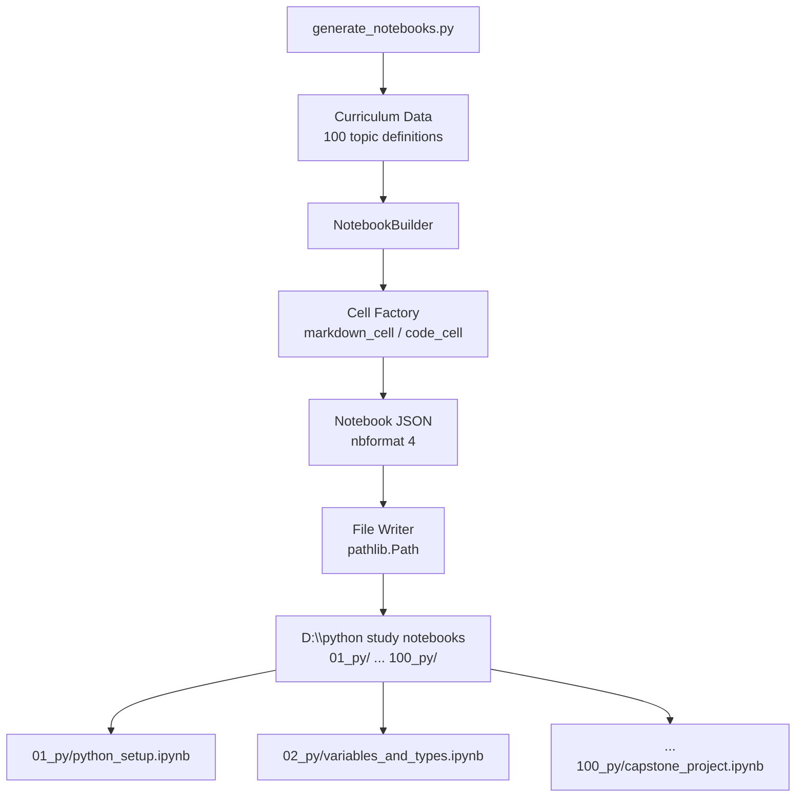

# Design Document

## Feature: python-study-notebooks

---

## Overview

This feature generates a complete 100-day Python learning curriculum as a set of Jupyter Notebook (`.ipynb`) files. A Python script acts as the **generator** — it creates the directory structure under `D:\python study notebooks`, writes each of the 100 notebooks as valid `nbformat 4` JSON, and populates every notebook with structured markdown and code cells following a consistent pedagogical template.

The generator is a single, self-contained Python script (`generate_notebooks.py`) that can be run once to produce the entire curriculum. It has no runtime dependencies beyond the Python standard library (all notebook content is written as plain JSON). The output is a static artifact: 100 folders, each containing one `.ipynb` file, ready to be opened in Jupyter Notebook or JupyterLab.

### Key Design Decisions

- **Generator-based approach**: Rather than hand-authoring 100 files, a script encodes the curriculum as structured data and renders each notebook from a template. This ensures consistency and makes bulk edits trivial.
- **Pure stdlib generation**: The generator uses only `json`, `os`, and `pathlib` — no `nbformat` library required at generation time. This keeps the generator portable and dependency-free.
- **Data-driven curriculum**: All 100 topics, their phases, and their content outlines are defined in a single data structure inside the generator. This is the single source of truth for the curriculum.
- **Standalone notebooks**: Every notebook is self-contained. No notebook imports state from another notebook.

---

## Architecture



### Component Responsibilities

| Component | Responsibility |
|-----------|---------------|
| `CURRICULUM` (data) | Defines all 100 days: day number, phase, topic title, filename stem, and content outline |
| `NotebookBuilder` | Assembles a complete notebook dict from a topic definition |
| Cell Factory functions | Create individual `markdown_cell` and `code_cell` dicts in nbformat 4 format |
| File Writer | Creates directories and writes JSON files to disk |
| `generate_notebooks.py` (entry point) | Orchestrates the full generation pipeline |

---

## Components and Interfaces

### 1. Curriculum Data Structure

Each entry in the `CURRICULUM` list is a dict with the following shape:

```python
{
    "day": int,                  # 1–100
    "phase": str,                # "Beginner" | "Intermediate" | "Advanced" | "Applied"
    "topic": str,                # Human-readable topic title
    "filename": str,             # snake_case stem, e.g. "variables_and_types"
    "concepts": list[str],       # Key concepts covered (drives explanation cells)
    "code_examples": list[dict], # Each: {"title": str, "code": str, "comment": str}
    "exercises": list[dict],     # Each: {"prompt": str, "solution": str}
    "libraries": list[str],      # External libraries to install (empty for stdlib)
    "references": list[int],     # Day numbers this notebook references (for cross-links)
    "takeaways": list[str],      # 2–5 bullet points for the summary cell
    "next_steps": list[str],     # 2–5 suggested further reading topics
}
```

### 2. Cell Factory

```python
def markdown_cell(source: str) -> dict:
    """Return an nbformat 4 markdown cell dict."""

def code_cell(source: str) -> dict:
    """Return an nbformat 4 code cell dict with empty outputs."""
```

### 3. NotebookBuilder

```python
class NotebookBuilder:
    def build(self, entry: dict) -> dict:
        """
        Assemble a complete nbformat 4 notebook dict from a curriculum entry.
        Cell order:
          1. Title & description (markdown)
          2. Library install instructions (markdown, if entry["libraries"])
          3. For each concept: explanation markdown + demo code cell(s)
          4. Exercise cells (code, with prompt as comment)
          5. Solution cells (code, preceded by "## Solution" markdown)
          6. Summary & next steps (markdown)
        Returns the notebook as a plain Python dict ready for json.dumps().
        """
```

### 4. Notebook JSON Schema (nbformat 4)

```python
{
    "nbformat": 4,
    "nbformat_minor": 4,
    "metadata": {
        "kernelspec": {
            "display_name": "Python 3",
            "language": "python",
            "name": "python3"
        },
        "language_info": {
            "name": "python",
            "version": "3.8.0"
        }
    },
    "cells": [ ... ]  # list of cell dicts
}
```

**Markdown cell:**
```python
{
    "cell_type": "markdown",
    "metadata": {},
    "source": "..."   # string or list of strings
}
```

**Code cell:**
```python
{
    "cell_type": "code",
    "execution_count": None,
    "metadata": {},
    "outputs": [],
    "source": "..."
}
```

### 5. File Writer

```python
def write_notebook(root: Path, day: int, filename: str, notebook: dict) -> Path:
    """
    Create root / f"{day:02d}_py" (or "100_py") / f"{filename}.ipynb"
    and write notebook as indented JSON (indent=1).
    Returns the path written.
    """
```

### 6. Entry Point

```python
def main(root: Path = Path(r"D:\python study notebooks")) -> None:
    """
    Iterate over CURRICULUM, build each notebook, write to disk.
    Print progress: "Day NN/100: <topic> -> <path>"
    """
```

---

## Data Models

### Folder Naming

| Day | Folder Name |
|-----|-------------|
| 1–9 | `01_py` … `09_py` |
| 10–99 | `10_py` … `99_py` |
| 100 | `100_py` |

Lexicographic sort of these names produces ascending day order because single-digit days are zero-padded to two digits.

### Notebook Cell Sequence (per notebook)

```
Cell 1:  [markdown] Title header — "# Day NN: <Topic Title>"
                                   Phase label, 2–4 sentence description
Cell 2:  [markdown] Install instructions (only if external libraries needed)
Cell 3+: [markdown] Concept explanation (one per concept)
         [code]     Demonstration code with inline comments
         ...        (repeated for each concept)
Cell N:  [markdown] "## Exercises"
Cell N+1:[code]     Exercise 1 prompt (as comment) + blank area for learner
Cell N+2:[code]     Exercise 2 prompt (as comment) + blank area for learner
         ...
Cell M:  [markdown] "## Solutions"
Cell M+1:[code]     Solution 1
Cell M+2:[code]     Solution 2
         ...
Cell Z:  [markdown] "## Summary & Next Steps"
                    Key takeaways (bullet list)
                    Suggested next steps / further reading
```

### Phase Boundaries

| Phase | Days | Count |
|-------|------|-------|
| Beginner | 01–25 | 25 |
| Intermediate | 26–50 | 25 |
| Advanced | 51–75 | 25 |
| Applied | 76–100 | 25 |

### Complete Topic-to-Filename Mapping

| Day | Filename Stem |
|-----|--------------|
| 01 | `python_setup_environment` |
| 02 | `variables_data_types` |
| 03 | `strings_and_methods` |
| 04 | `numbers_arithmetic_math` |
| 05 | `boolean_logic_comparisons` |
| 06 | `lists_creation_indexing` |
| 07 | `lists_methods_mutation` |
| 08 | `tuples_immutability` |
| 09 | `sets_and_operations` |
| 10 | `dictionaries_basics` |
| 11 | `dictionaries_advanced` |
| 12 | `conditional_statements` |
| 13 | `for_loops_range` |
| 14 | `while_loops_control` |
| 15 | `list_comprehensions` |
| 16 | `functions_definition_arguments` |
| 17 | `functions_return_scope` |
| 18 | `lambda_map_filter_reduce` |
| 19 | `modules_importing` |
| 20 | `file_io_text` |
| 21 | `file_io_csv` |
| 22 | `exception_handling_basics` |
| 23 | `exception_handling_custom` |
| 24 | `recursion` |
| 25 | `beginner_capstone` |
| 26 | `oop_classes_objects` |
| 27 | `oop_inheritance_polymorphism` |
| 28 | `oop_encapsulation_properties` |
| 29 | `oop_dunder_methods` |
| 30 | `iterators_iterables` |
| 31 | `generators_yield` |
| 32 | `decorators` |
| 33 | `context_managers` |
| 34 | `dict_set_comprehensions` |
| 35 | `regular_expressions` |
| 36 | `working_with_json` |
| 37 | `working_with_csv` |
| 38 | `datetime_time_modules` |
| 39 | `os_sys_modules` |
| 40 | `collections_module` |
| 41 | `itertools_module` |
| 42 | `functools_module` |
| 43 | `virtual_environments_pip` |
| 44 | `sorting_searching_algorithms` |
| 45 | `recursion_advanced` |
| 46 | `string_formatting_fstrings` |
| 47 | `pathlib_filesystem` |
| 48 | `logging_module` |
| 49 | `argparse_cli` |
| 50 | `intermediate_capstone` |
| 51 | `type_hints_annotations` |
| 52 | `dataclasses` |
| 53 | `abstract_base_classes` |
| 54 | `metaclasses` |
| 55 | `slots_memory_optimization` |
| 56 | `threading` |
| 57 | `multiprocessing` |
| 58 | `asyncio_basics` |
| 59 | `asyncio_advanced` |
| 60 | `testing_unittest` |
| 61 | `testing_pytest` |
| 62 | `mocking_test_fixtures` |
| 63 | `packaging_pyproject` |
| 64 | `design_patterns_creational` |
| 65 | `design_patterns_structural` |
| 66 | `design_patterns_behavioral` |
| 67 | `performance_profiling` |
| 68 | `memory_profiling_optimization` |
| 69 | `cython_ctypes_basics` |
| 70 | `descriptors_attribute_access` |
| 71 | `closures_scoping` |
| 72 | `functional_programming` |
| 73 | `comprehensions_advanced` |
| 74 | `python_internals_bytecode` |
| 75 | `advanced_capstone` |
| 76 | `numpy_arrays_operations` |
| 77 | `numpy_indexing_broadcasting` |
| 78 | `numpy_linear_algebra_stats` |
| 79 | `pandas_series_dataframes` |
| 80 | `pandas_loading_inspecting` |
| 81 | `pandas_data_cleaning` |
| 82 | `pandas_filtering_querying` |
| 83 | `pandas_groupby_aggregation` |
| 84 | `pandas_merging_joining` |
| 85 | `pandas_time_series` |
| 86 | `matplotlib_basic_plots` |
| 87 | `matplotlib_customization` |
| 88 | `seaborn_statistical_viz` |
| 89 | `plotly_interactive_viz` |
| 90 | `web_scraping_beautifulsoup` |
| 91 | `rest_api_consumption` |
| 92 | `sql_sqlite3` |
| 93 | `sqlalchemy_orm` |
| 94 | `sklearn_preprocessing` |
| 95 | `sklearn_supervised_learning` |
| 96 | `sklearn_unsupervised_learning` |
| 97 | `sklearn_model_evaluation` |
| 98 | `nlp_nltk_spacy` |
| 99 | `image_processing_pillow` |
| 100 | `capstone_end_to_end_pipeline` |

---

## Correctness Properties

*A property is a characteristic or behavior that should hold true across all valid executions of a system — essentially, a formal statement about what the system should do. Properties serve as the bridge between human-readable specifications and machine-verifiable correctness guarantees.*

### Property 1: Folder count and naming

*For any* generated curriculum output, the root directory SHALL contain exactly 100 subdirectories, each named according to the pattern `NN_py` (zero-padded for days 1–99, `100_py` for day 100), and their lexicographic sort order SHALL equal their ascending day order.

**Validates: Requirements 1.2, 1.3, 1.4**

---

### Property 2: One notebook per folder

*For any* generated day folder, it SHALL contain exactly one file, and that file SHALL have the `.ipynb` extension.

**Validates: Requirements 1.5, 2.3**

---

### Property 3: Notebook filename is snake_case

*For any* generated notebook filename (excluding the `.ipynb` extension), the name SHALL consist only of lowercase ASCII letters, digits, and underscores, with no spaces or other special characters.

**Validates: Requirements 2.2**

---

### Property 4: Valid nbformat 4 JSON round-trip

*For any* generated `.ipynb` file, parsing it as JSON SHALL succeed, and the resulting object SHALL have `nbformat == 4`, `nbformat_minor >= 4`, a `kernelspec` with `"language": "python"`, and a `language_info` field with `"name": "python"`.

**Validates: Requirements 8.1, 8.2, 8.3**

---

### Property 5: Notebook cell structure invariants

*For any* generated notebook, the `cells` list SHALL satisfy all of the following simultaneously:
- The first cell is a markdown cell whose source begins with `# Day`
- There are at least 3 code cells
- There are at least 2 exercise code cells (identifiable by an `# Exercise` comment marker)
- There is at least 1 solution cell or markdown section containing `Solution`
- The last cell is a markdown cell containing `Summary` or `Next Steps`

**Validates: Requirements 3.1, 3.3, 3.4, 3.5, 3.6**

---

### Property 6: Standalone self-containment (no cross-notebook imports)

*For any* generated notebook, no code cell SHALL contain an import of a path or module that references another notebook's filename stem (i.e., no `import 01_py`, no `%run` magic pointing to another day folder).

**Validates: Requirements 3.7**

---

### Property 7: Phase assignment correctness

*For any* generated notebook at day `d`, the phase label embedded in the title markdown cell SHALL match the expected phase: Beginner for d ∈ [1,25], Intermediate for d ∈ [26,50], Advanced for d ∈ [51,75], Applied for d ∈ [76,100].

**Validates: Requirements 4.1**

---

### Property 8: No duplicate primary topics

*For any* two distinct generated notebooks, their topic titles SHALL NOT be identical.

**Validates: Requirements 4.7**

---

### Property 9: Code cell syntax validity

*For any* code cell in any generated notebook, parsing the cell's source with `ast.parse()` SHALL succeed without raising a `SyntaxError`, confirming all code is valid Python 3.8+ syntax.

**Validates: Requirements 5.1, 5.4**

---

### Property 10: Code cells contain inline comments

*For any* code cell in any generated notebook whose source contains more than one line of code, the source SHALL contain at least one `#` comment character.

**Validates: Requirements 5.3**

---

### Property 11: Library install cell present when needed

*For any* generated notebook whose curriculum entry has a non-empty `libraries` list, the notebook SHALL contain at least one markdown cell whose source includes the string `pip install`.

**Validates: Requirements 3.8**

---

### Property 12: Cross-reference links present when needed

*For any* generated notebook whose curriculum entry has a non-empty `references` list, the notebook's markdown source SHALL mention each referenced day number.

**Validates: Requirements 4.6**

---

### Property 13: Curriculum completeness

*For any* run of the generator, the curriculum data SHALL contain exactly 100 entries with day numbers forming the complete set {1, 2, …, 100} with no gaps or duplicates.

**Validates: Requirements 9.1**

---

## Error Handling

### Generator Script Errors

| Scenario | Handling |
|----------|----------|
| `D:\python study notebooks` already exists | Script proceeds; existing files are overwritten (idempotent re-run) |
| Disk full or permission denied on write | `OSError` propagates with a clear message; partial output is left in place |
| Invalid curriculum data (missing key) | `KeyError` raised at build time with the day number in the message |
| Duplicate filename stems in curriculum data | Detected at startup with a `ValueError` listing the duplicates |

### Notebook Content Errors

| Scenario | Handling |
|----------|----------|
| Code cell intentionally raises an exception | Wrapped in `try/except` block within the cell source |
| External library not installed at run time | Notebook includes `pip install` instruction in a markdown cell; learner installs before running |

---

## Testing Strategy

### Overview

This feature is a **code generator** — a pure function from curriculum data to files on disk. The primary testing concern is that the generator produces structurally correct, consistent output. Property-based testing is well-suited here because the correctness properties (folder naming, JSON validity, cell structure) must hold for all 100 notebooks, not just a handful of examples.

### Property-Based Testing

**Library**: `hypothesis` (Python)

Each property test generates random subsets of the curriculum (or synthetic curriculum entries) and verifies the invariant holds. Minimum 100 iterations per property.

| Test | Property | Tag |
|------|----------|-----|
| `test_folder_naming` | Property 1 | `Feature: python-study-notebooks, Property 1: folder count and naming` |
| `test_one_notebook_per_folder` | Property 2 | `Feature: python-study-notebooks, Property 2: one notebook per folder` |
| `test_filename_snake_case` | Property 3 | `Feature: python-study-notebooks, Property 3: notebook filename is snake_case` |
| `test_valid_nbformat4_json` | Property 4 | `Feature: python-study-notebooks, Property 4: valid nbformat 4 JSON round-trip` |
| `test_cell_structure_invariants` | Property 5 | `Feature: python-study-notebooks, Property 5: notebook cell structure invariants` |
| `test_no_cross_notebook_imports` | Property 6 | `Feature: python-study-notebooks, Property 6: standalone self-containment` |
| `test_phase_assignment` | Property 7 | `Feature: python-study-notebooks, Property 7: phase assignment correctness` |
| `test_no_duplicate_topics` | Property 8 | `Feature: python-study-notebooks, Property 8: no duplicate primary topics` |
| `test_code_syntax_validity` | Property 9 | `Feature: python-study-notebooks, Property 9: code cell syntax validity` |
| `test_code_cells_have_comments` | Property 10 | `Feature: python-study-notebooks, Property 10: code cells contain inline comments` |
| `test_library_install_cell` | Property 11 | `Feature: python-study-notebooks, Property 11: library install cell present when needed` |
| `test_cross_reference_links` | Property 12 | `Feature: python-study-notebooks, Property 12: cross-reference links present when needed` |
| `test_curriculum_completeness` | Property 13 | `Feature: python-study-notebooks, Property 13: curriculum completeness` |

### Unit / Example-Based Tests

- **Day 01 special content**: Verify the Day 01 notebook contains installation instructions and "how to run a cell" explanation (Requirements 6.3, 6.4).
- **Day 100 capstone**: Verify the Day 100 notebook references concepts from at least 3 different phases (Requirement 7.3).
- **Library install cell**: For a notebook with `libraries` populated (e.g., Day 76 NumPy), verify a markdown cell containing `pip install` is present (Requirement 3.8).
- **Cross-reference links**: For a notebook with `references` populated, verify the markdown source mentions the referenced day number (Requirement 4.6).
- **Beginner phase term definitions**: Spot-check that Day 02 defines "variable" and "data type" in a markdown cell before the first code cell (Requirement 6.2).

### Integration Test

- Run `generate_notebooks.py` against a temp directory and verify:
  - Exactly 100 folders are created.
  - Each folder contains exactly one `.ipynb` file.
  - All 100 files parse as valid JSON with `nbformat == 4`.
  - Total file count is 100.
